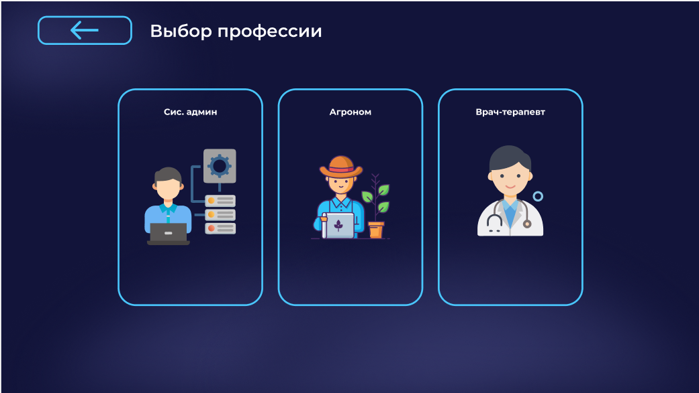

# 🥽 VR-симулятор профессий

Интерактивное обучающее приложение в виртуальной реальности, в котором пользователь осваивает три профессиональные роли в формате практических сценариев: **агроном**, **системный администратор** и **врач**. Проект сочетает реалистичные действия, геймификацию и наглядные обучающие ситуации.

---

## 🎮 Основные возможности

- Полноценное **VR-взаимодействие с объектами и инструментами**
- Главное меню с выбором одной из трёх профессий
- Практические задания и последовательные сценарии
- Обучающий и игровой формат прохождения
- Подсказки и понятная структура действий

---

## 🧭 Главное меню

После запуска пользователь попадает в главное меню и выбирает профессию для прохождения сценария.

> _Скриншот меню_

> _Скриншот выбора_

---

## 🌱 Профессия: Агроном

Игрок проводит анализ состояния почвы и растений, использует инструменты диагностики, осматривает участки и принимает решения на основе собранных данных.

> _Скриншоты сценария агронома_

---

## 🖥️ Профессия: Системный администратор

Пользователь собирает компьютер, подключает комплектующие, выполняет обжим сетевых кабелей и проводит базовую настройку оборудования.

> _Скриншоты сценария системного администратора_

---

## 🩺 Профессия: Врач

Игрок взаимодействует с пациентами, собирает данные, проводит анализ состояния и применяет медицинские инструменты в симулированной среде.

> _Скриншоты сценария врача_

---

## 🛠️ Технологии

- Виртуальная реальность (VR)
- Интерактивные 3D-сцены и физическое взаимодействие
- Сценарные системы и обучающие подсказки

> _При необходимости добавьте движок, SDK и платформы (Unity / Unreal, OpenXR, SteamVR и т.д.)._

---

## 🚀 Запуск проекта

1. Установить необходимые зависимости
2. Подключить VR-устройство
3. Собрать и запустить проект в режиме VR

> _Здесь можно указать точные версии инструментов и шаги сборки._

---

## 📸 Галерея

---

## 📌 Статус проекта

Проект находится в стадии разработки / демонстрационной версии.  
Функционал постепенно дополняется и улучшается.

---

## 👥 Авторы

Проект разработан командой разработчиков.  
При необходимости доработки или интеграции — свяжитесь с нами.
